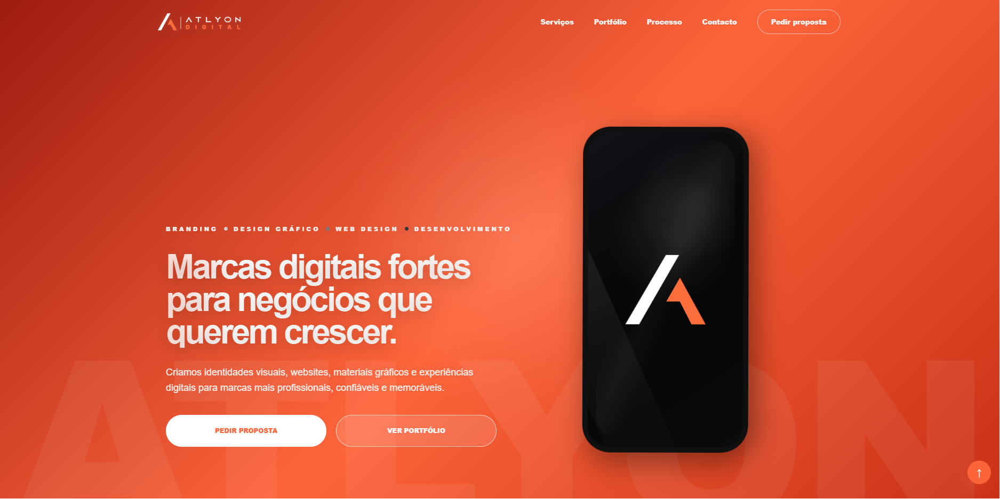
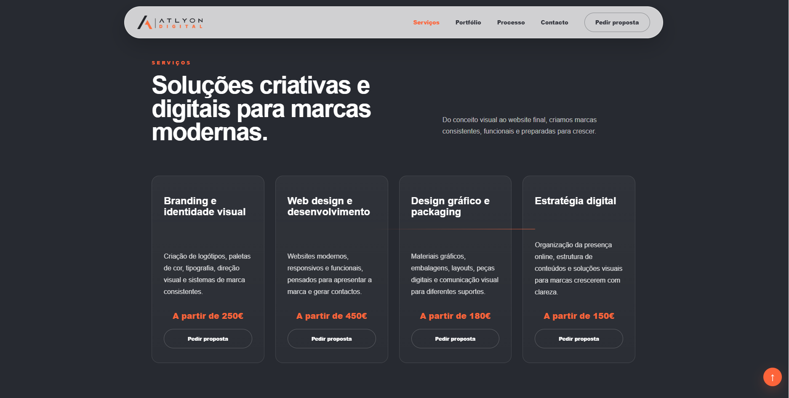
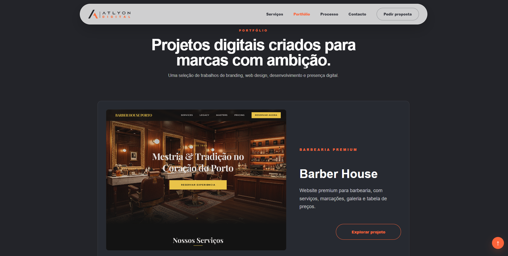
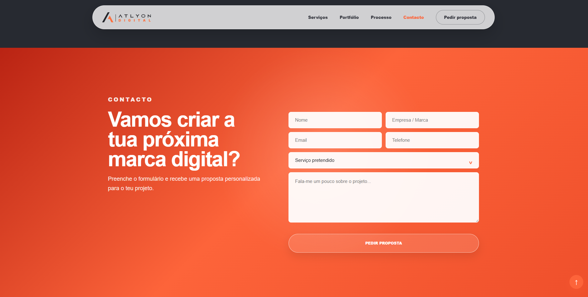
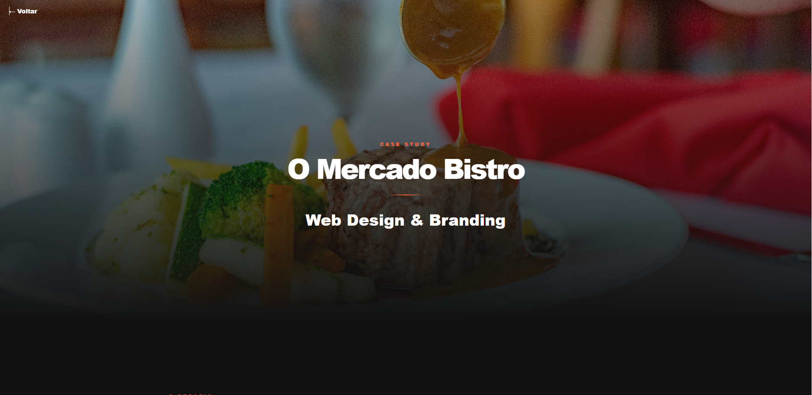
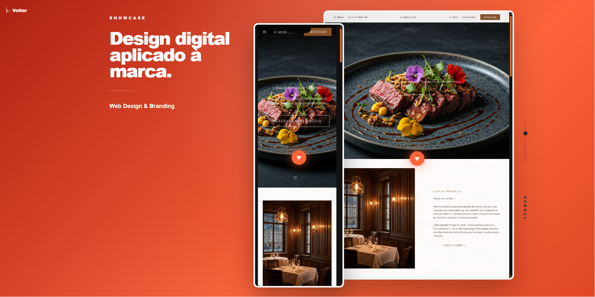

# Atlyon Digital

Website institucional desenvolvido para a **Atlyon Digital**, uma agência focada em Web Design, Desenvolvimento Web, Branding e Soluções Digitais para empresas.

O objetivo deste projeto foi criar uma presença digital premium, moderna e orientada para conversão, transmitindo profissionalismo e confiança desde o primeiro contacto.

---

## Objetivos do Projeto

- Apresentar os serviços da Atlyon Digital.
- Demonstrar casos de estudo reais através de páginas dedicadas.
- Reforçar a identidade visual da marca.
- Criar uma experiência moderna e responsiva.
- Facilitar o contacto de potenciais clientes.
- Preparar a plataforma para futura integração com formulários, emails empresariais e automações.

---

## Tecnologias Utilizadas

### Frontend

- Angular 21
- TypeScript
- HTML5
- SCSS
- Angular Standalone Components

### Design

- Design System próprio
- Layout responsivo
- Gradientes personalizados
- Animações CSS
- Mockups Desktop e Mobile
- Tipografia Inter

---

## Funcionalidades

### Landing Page

- Hero section premium
- Apresentação da empresa
- Serviços
- Processo de trabalho
- Portefólio
- Formulário de contacto

### Portfolio

- Cards de projetos
- Hover interactions
- Navegação para Case Studies

### Case Studies

Cada projeto possui uma página dedicada com:

- Desafio do projeto
- Apresentação visual
- Mockups Desktop
- Mockups Mobile
- Sistema de scroll interno
- Identidade visual
- Cores utilizadas
- Tipografia utilizada

### Contacto

- Formulário de contacto
- Preparado para integração com EmailJS ou backend próprio

---

## Estrutura do Projeto

```txt
src/
│
├── app/
│   ├── project-case/
│   ├── portfolio/
│   ├── services/
│   ├── process/
│   └── contact/
│
public/
│
├── projects/
│   ├── imagens dos projetos
│   └── mockups
│
└── doc/
    ├── print1.png
    ├── print2.png
    ├── print3.png
    ├── print4.png
    ├── print5.png
    └── print6.png
```

---

# Screenshots

## Homepage



---

## Processo



---

## Portfolio



---

## Case Study



---

## Identidade Visual



---

## Contacto



---

## Melhorias Futuras

- Integração do formulário com EmailJS
- Emails empresariais personalizados
- CMS para gestão de projetos
- Blog
- Sistema de marcações online
- Dashboard administrativa
- Analytics avançados

---

## Autor

Desenvolvido por **Joana Castro**

Atlyon Digital © 2026