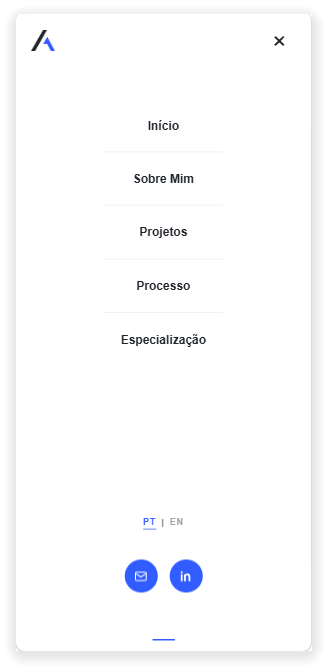
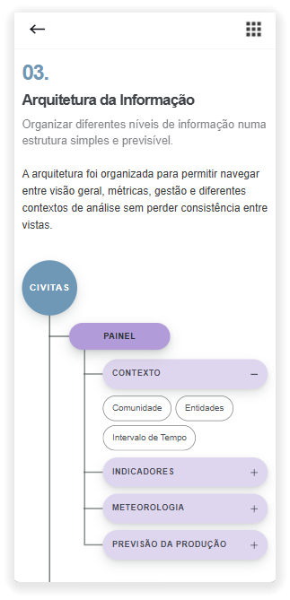
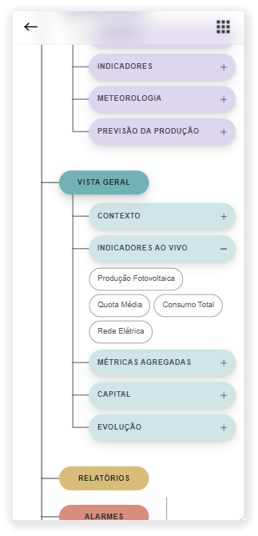
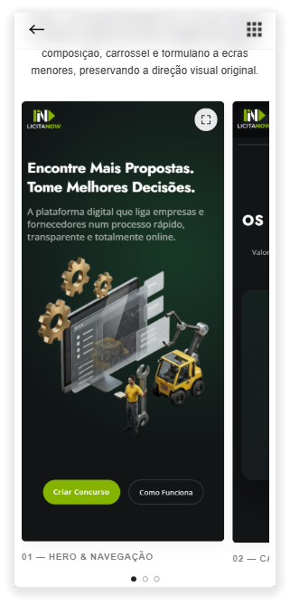
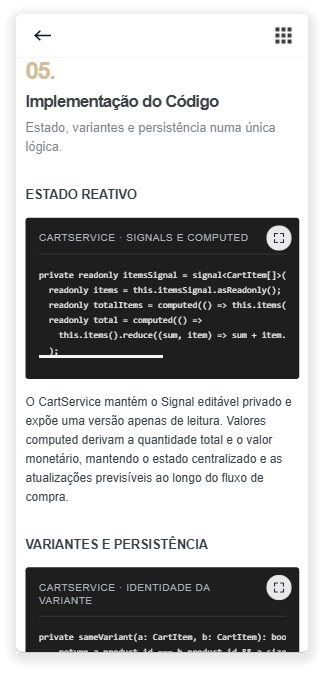
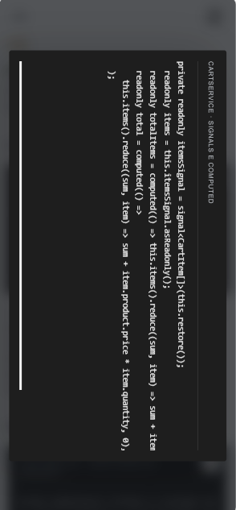
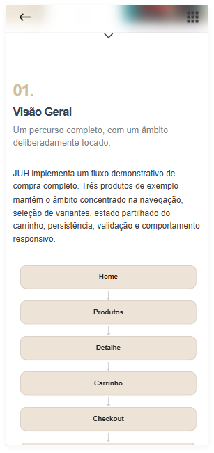
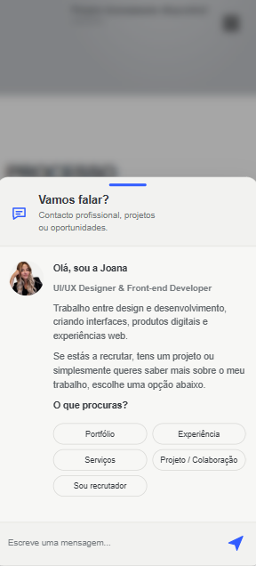

# Atlyon — UI/UX & Front-end Portfolio

Atlyon is my latest end-to-end UI/UX and front-end project — a portfolio designed and developed from scratch as a digital product in its own right.

It brings together product design, visual direction and Angular development in a responsive bilingual experience built around real case studies. Rather than treating mobile as a reduced desktop layout, the interface uses breakpoint-specific composition, interaction and navigation decisions to preserve hierarchy, context and usability across screen sizes.

🌐 **Live Portfolio:** https://atlyon.pt


---

## At a Glance

**Role** — UI/UX Design · Front-end Development<br>
**Design** — Figma<br>
**Development** — Angular · TypeScript · SCSS<br>
**Experience** — Desktop · Mobile · PT/EN<br>
**Focus** — Product Design · Responsive UX · Design-to-Code<br>
**Release** — v1.0.0 · Ongoing

---

## Why I Built It

Atlyon was created to present design and development as parts of the same process rather than separate disciplines.

The portfolio itself became an opportunity to explore information architecture, visual hierarchy, responsive behaviour, interaction design and front-end implementation while building a system capable of supporting different types of case studies.

---

## The Experience

The homepage establishes the positioning and leads into detailed case studies through a coherent visual system that preserves each product's identity.


The process communicates the connection between strategy, design, development and validation:

**Context & Objectives → Strategy & Direction → Design & Development → Validation & Delivery**


---

## Design Decisions → Implementation

Atlyon was refined through decisions that connect interface behaviour with implementation. Responsive adaptation was treated as a design problem, not only a CSS breakpoint problem.

| UX / Design decision | Implementation |
| --- | --- |
| Preserve narrative on mobile without excessive vertical scroll | Breakpoint-specific carousels with swipe, peek and pagination cues |
| Keep technical code readable on small screens | Horizontal code exploration with optional landscape expansion |
| Preserve context in before / after comparisons | Responsive comparison patterns tailored to each case study |
| Communicate additional horizontal content without instructions | Partial next-slide visibility and pagination cues |
| Make mobile navigation more touch-oriented | Mobile drawer with gesture support and alternative close controls |
| Maintain motion without compromising user preferences | Reduced-motion handling for animated interactions |
| Keep case studies visually coherent | Shared typography, spacing and reusable interaction patterns |
| Support different audiences | PT / EN interface and content states |

---

## Responsive UX in Practice

Mobile was designed as a distinct composition rather than a scaled-down desktop interface. Content remains vertical when sequence is important and becomes swipe-based selectively when horizontal exploration reduces density without compromising context.

### Touch-oriented Navigation

The mobile navigation uses a dedicated drawer with language controls, direct contact access and touch-oriented closing. A subtle drag handle adds a gesture cue without replacing the conventional close control.

<p align="center">
  
</p>

### Responsive Information Architecture

Complex information structures are reorganised vertically on smaller screens while preserving hierarchy and relationships between information levels.

<p align="center">
  &nbsp;&nbsp;
  
</p>

### Selective Horizontal Navigation

Dense mobile sequences become swipe-based only where this improves scanning. Partial visibility of the next item and pagination dots reveal additional content without requiring instructions.

<p align="center">
  
</p>

### Technical Content on Small Screens

Code examples remain horizontally explorable in context and can be expanded into a landscape presentation when additional reading space is useful.

<p align="center">
  &nbsp;&nbsp;
  
</p>

---

## Featured Case Studies

### Civitas — Energy Management Platform

A SaaS product experience for energy management, translating production, consumption and performance data into structured dashboards and reusable interface patterns.

**Focus** — Product UI/UX · SaaS Dashboards · Information Architecture · Design-to-Code

Key areas:

- Dashboard architecture
- Information hierarchy
- Data visualisation
- Reusable components
- Desktop/mobile adaptation
- Design-to-code workflow


🌐 **Case study:** https://atlyon.pt/case-studies/civitas

---

### LicitaNow — Landing Page Redesign

A redesign project focused on clarifying hierarchy, strengthening the user journey and creating a more distinctive digital experience for a construction-sector platform.

**Focus** — UX Analysis · Visual Hierarchy · Responsive Redesign · Front-end

Key areas:

- UX analysis
- Information prioritisation
- Visual direction
- Before/after evaluation
- Responsive adaptation
- Front-end implementation


🌐 **Case study:** https://atlyon.pt/case-studies/licitanow

---

### JUH — Angular E-commerce

An Angular e-commerce demonstration built around a complete product flow, connecting interface decisions with reactive state, routing, variant handling, persistence, validation and responsive behaviour.

**Focus** — Angular · Front-end Architecture · State · Routing · Validation · Responsive UX

Key areas:

- Product flow
- Angular state management
- Cart persistence
- Product variants
- Routing
- Reactive Forms validation
- Responsive behaviour
- Technical validation and tests

<p align="center">
  
</p>

🌐 **Case study:** https://atlyon.pt/case-studies/juh<br>
💻 **Source code:** https://github.com/joanadecastro/juh-angular-ecommerce

---

## Guided Contact Experience

Contact is part of the product experience. Rather than relying only on a static form, Atlyon directs different visitor intents — including recruiters, collaborations and project enquiries — towards relevant information or contact paths.

<p align="center">
  
</p>

---

## Architecture & Front-end

Atlyon is implemented as an Angular single-page application with shared interface patterns, case-study-specific experiences, multilingual content and responsive behaviour managed within the same front-end project.

- Angular / TypeScript application
- Component-based interface structure
- Shared typography and spacing system
- Reusable interaction patterns
- Case-study-specific responsive behaviour
- PT / EN content states
- Static project and portfolio assets
- Netlify deployment

### AI-Assisted Workflow

AI-assisted tools supported exploration, implementation and iteration throughout the project. UX direction, visual decisions, architecture and validation remained directly controlled throughout the design and development process.

- Claude Code
- OpenAI Codex
- Google Stitch

---

## Interaction & Accessibility

- Touch and swipe interactions on mobile
- Responsive navigation
- Keyboard and focus handling where implemented
- Reduced-motion handling for animated interactions
- Media expansion and lightbox behaviour
- Interaction cues such as pagination and partial next-item visibility

---

## Tech Stack

| Area | Technologies |
| --- | --- |
| Framework | Angular |
| Languages | TypeScript · JavaScript · HTML5 |
| Styling | SCSS · CSS |
| UI/UX | Figma · Responsive Design · Design Systems |
| Architecture | Component-based UI · Reusable Interfaces |
| Testing | Vitest · Angular TestBed |
| Version Control | Git · GitHub |
| Deployment | Netlify |
| AI-Assisted Workflow | Claude Code · OpenAI Codex · Google Stitch |

---

## Development

```bash
npm install
ng serve
npm run build
```

---

## Version & Evolution

**Current release: v1.0.0**

This release represents the first complete public version of Atlyon. The portfolio will continue to evolve through new case studies, interaction refinements and improvements informed by use and feedback.

---

## Author

**Joana Castro**<br>
UI/UX Designer & Front-end Developer

🌐 Portfolio — https://atlyon.pt<br>
💼 LinkedIn — https://www.linkedin.com/in/joanadecastro/<br>
💻 GitHub — https://github.com/joanadecastro

---

### Design & Development — Joana Castro
