# Atlyon — UI/UX & Front-end Portfolio

Atlyon is my personal **UI/UX and Front-end portfolio**, designed and developed to present selected digital products, interfaces and case studies through a single cohesive experience.

The project reflects the way I work across **design and development** — from strategy and visual direction to interface design, responsive implementation and interaction.

🌐 **Live website:** https://atlyon.pt

---

## Overview

The portfolio was designed around a simple objective: **present design and implementation as part of the same process**.

Rather than functioning as a traditional project gallery, Atlyon combines:

- UI/UX and Product Design
- Front-end Development
- Digital Product Case Studies
- Responsive Design
- Information Architecture
- Design Systems and reusable components
- Branding and Visual Communication
- Interactive and guided contact experiences
- AI-assisted design and development workflows

The interface itself is part of the work being presented — combining visual direction, usability, responsive behaviour and front-end implementation.

---

## Portfolio Experience

### Homepage

The homepage introduces the core positioning — **UI/UX & Front-end** — through a minimal, editorial interface designed to keep the focus on the work.

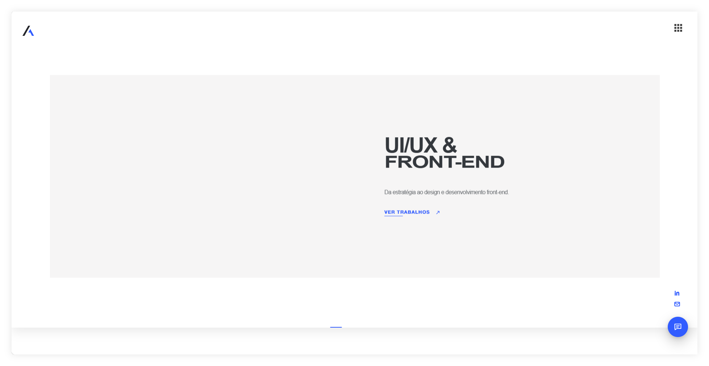

---

### Selected Projects

Projects link directly to detailed case studies. A consistent visual system gives each product its own identity.

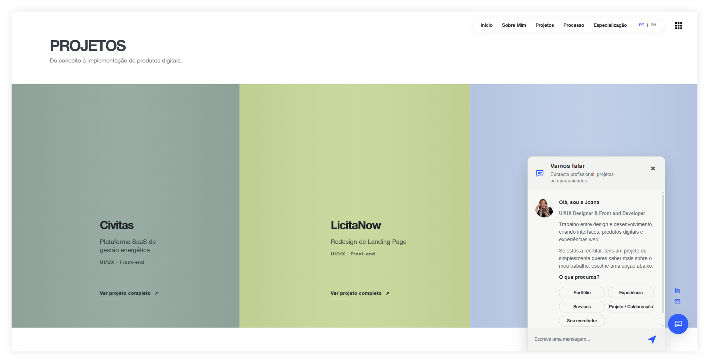

---

### Process

The portfolio also presents the workflow behind each project:

**Context & Objectives → Strategy & Direction → Design & Development → Validation & Delivery**

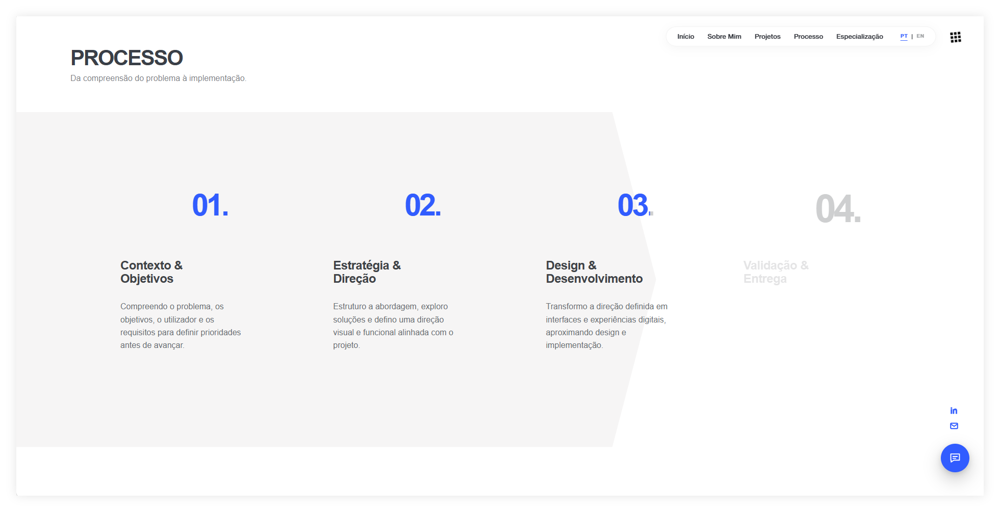

---

## Featured Case Studies

### Civitas — Energy Management Platform

UI/UX and front-end development for an **energy-management SaaS platform**.

The project transforms energy production, consumption and performance data into clear and usable interfaces, connecting product-design decisions with implementation.

Key areas:

- SaaS dashboard design
- Information architecture
- Data visualisation
- Reusable UI components
- Responsive interfaces
- Desktop and mobile experiences
- Design-to-code workflow

**UI/UX · Front-end**

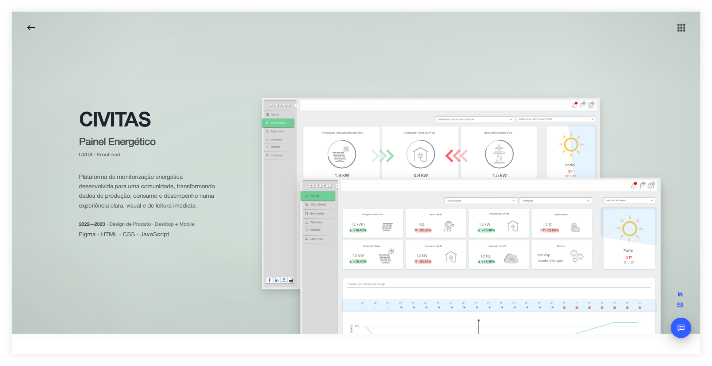

### Information Architecture

The product architecture was structured to organise multiple levels of information across dashboards, metrics, management and analysis contexts.

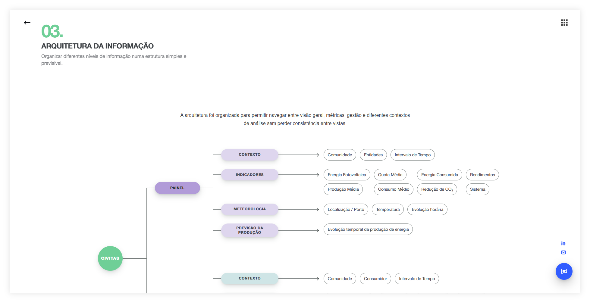

🌐 **Case study:** https://atlyon.pt/case-studies/civitas

---

### LicitaNow — Landing Page Redesign

Redesign of a digital platform for the construction sector, focused on creating a clearer hierarchy, stronger user journey and more distinctive digital experience.

Key areas:

- UX analysis
- Visual hierarchy
- User journey
- Information prioritisation
- Interface redesign
- Responsive design
- Front-end implementation

**UI/UX · Front-end**

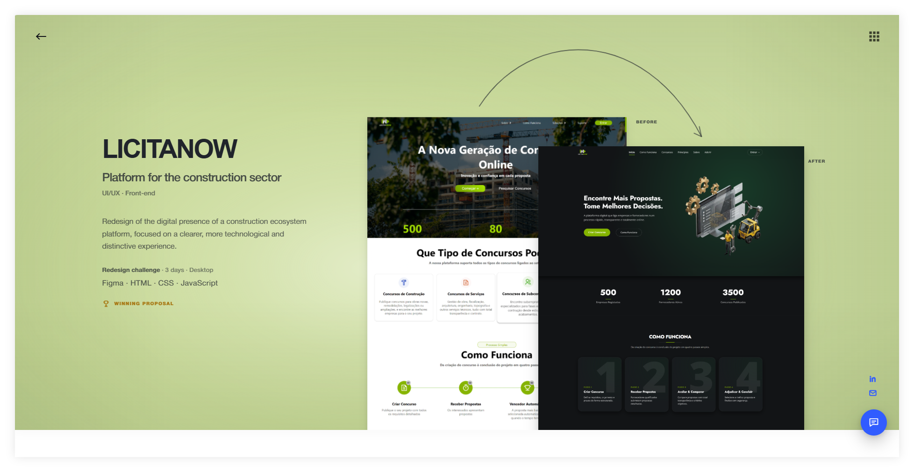

### Redesign Overview

The redesign brings together the decisions made throughout the process into a clearer and more cohesive landing-page experience.

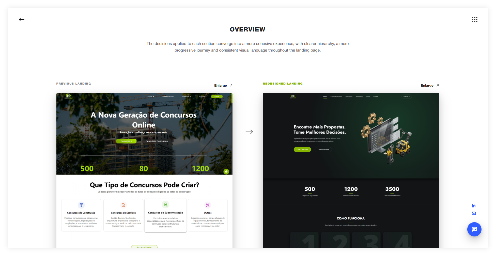

### Problems & Solutions

The case study documents the main experience problems identified in the original landing page and the design decisions used to address them.

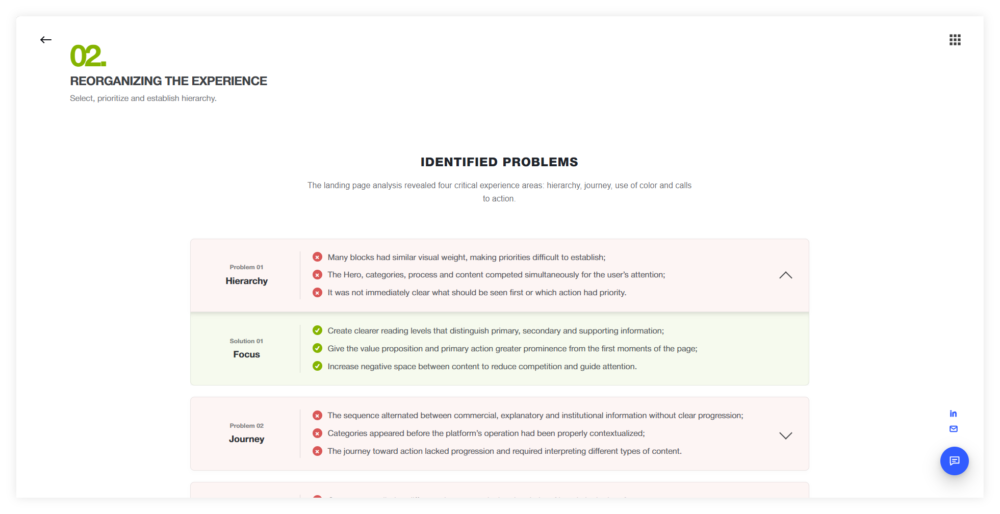

🌐 **Case study:** https://atlyon.pt/case-studies/licitanow

---

### Smart Charging — EV Charging Management

Digital product work for a SaaS platform focused on electric-vehicle charging management.

**UI/UX · Front-end**

**Case study coming soon.**

---

## Responsive Experience

The mobile version was designed as an experience in its own right, rather than a scaled-down desktop interface.

Navigation, content hierarchy, project presentation, process and contact interactions were specifically adapted for smaller screens.

<table>
  <tr>
    <td align="center"><strong>Hero</strong></td>
    <td align="center"><strong>Projects</strong></td>
    <td align="center"><strong>Process</strong></td>
    <td align="center"><strong>Navigation</strong></td>
    <td align="center"><strong>Chat</strong></td>
  </tr>
  <tr>
    <td>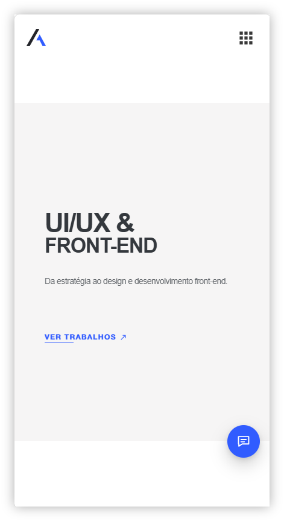</td>
    <td>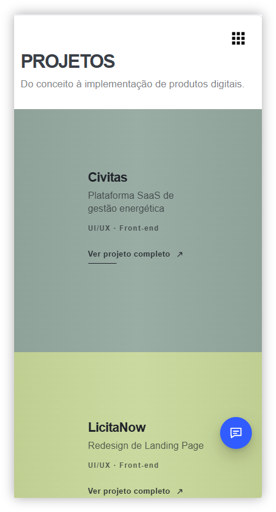</td>
    <td>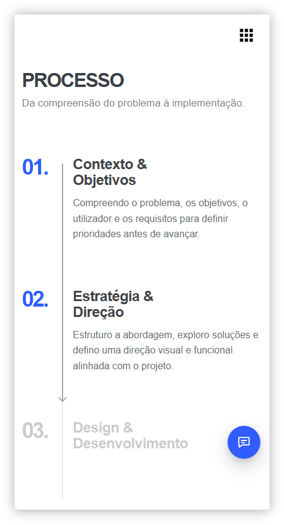</td>
    <td>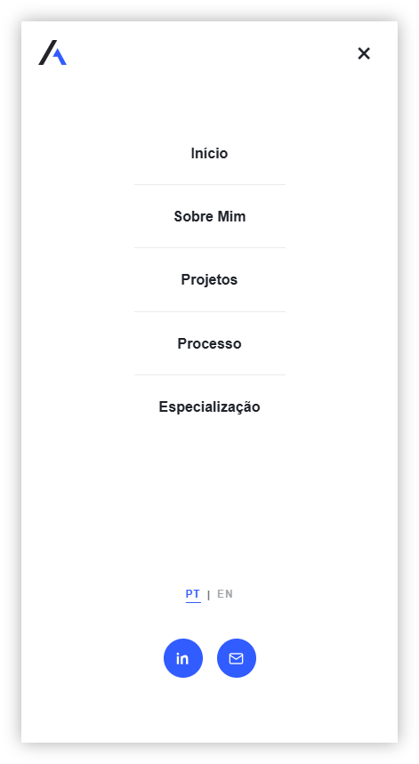</td>
    <td>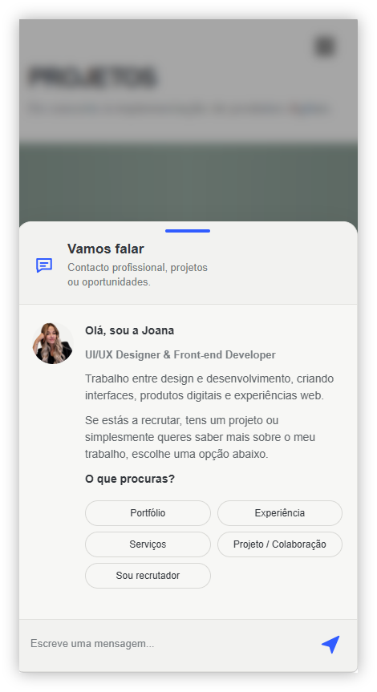</td>
  </tr>
</table>

---

## Design & Development

Atlyon was designed and developed from scratch, with particular attention to maintaining consistency between the **visual system, user experience and implementation**.

### UI/UX & Product Design

- Figma
- Interface Design
- User Experience
- Responsive Design
- Design Systems
- Information Architecture
- Visual Hierarchy
- Interaction Design
- Digital Product Design

### Front-end Development

- Angular
- TypeScript
- JavaScript
- HTML5
- SCSS / CSS
- Responsive Web Development
- Component-based Interfaces
- Reusable UI Components
- Git / GitHub

### AI-Assisted Workflow

AI tools are integrated into the design and development workflow to support **exploration, implementation and iteration**, while keeping UX, visual direction and implementation decisions under direct control.

- Claude Code
- OpenAI Codex
- Google Stitch

---

## Key Features

The current portfolio includes:

- Responsive desktop and mobile layouts
- PT / EN multilingual experience
- Interactive project cards
- Detailed case-study pages
- Responsive case-study layouts
- Animated process presentation
- Information-architecture visualisations
- Before / after project comparisons
- Contextual project navigation
- Fixed social/contact actions
- Guided contact experience
- Recruiter-specific contact path
- Project enquiry and budget flow
- Email delivery for project enquiries
- Reusable interface patterns and components

---

## Guided Contact Experience

The portfolio includes a custom guided contact interface designed around different visitor intents.

Visitors can explore paths for:

- Portfolio
- Experience
- Services
- Project / Collaboration
- Recruiter enquiries
- Project quotes

The enquiry form collects the project type, objective, budget, name and email before the visitor submits the request.

<p align="center">
  
</p>

---

## Architecture

Atlyon is built as an **Angular single-page application**, with the portfolio, case studies, reusable interface behaviour and multilingual content managed within the same front-end project.

The application separates:

- Main portfolio experience
- Case-study experiences
- Reusable UI behaviour
- Internationalised content
- Static project assets
- CV and portfolio resources

---

## Project Structure

```txt
atlyon-digital/
│
├── src/
│   └── app/
│       ├── i18n/
│       ├── project-case/
│       ├── licitanow-case/
│       ├── app.ts
│       ├── app.html
│       └── app.scss
│
├── public/
│   ├── cv/
│   └── projects/
│       ├── civitas/
│       ├── licita/
│       ├── smartcharging/
│       ├── readmeGithub/
│       └── ...
│
├── angular.json
├── netlify.toml
├── package.json
└── README.md
```

---

## Tech Stack

| Area | Technologies |
|---|---|
| **Framework** | Angular |
| **Languages** | TypeScript · JavaScript · HTML5 |
| **Styling** | SCSS · CSS |
| **UI/UX** | Figma · Responsive Design · Design Systems |
| **Architecture** | Component-based UI · Reusable Interfaces |
| **Version Control** | Git · GitHub |
| **AI-Assisted Workflow** | Claude Code · OpenAI Codex · Google Stitch |
| **Deployment** | Netlify |

---

## Development

Install dependencies:

```bash
npm install
```

Run the development server:

```bash
ng serve
```

Open the local address shown in the terminal.

Create a production build:

```bash
npm run build
```

---

## Live Portfolio

The complete portfolio and case studies are available at:

🌐 **https://atlyon.pt**

---

## Author

**Joana Castro**  
UI/UX Designer & Front-end Developer

🌐 Portfolio — https://atlyon.pt  
💼 LinkedIn — https://www.linkedin.com/in/joanadecastro/  
💻 GitHub — https://github.com/joanadecastro

---

### Design & Development — Joana Castro
